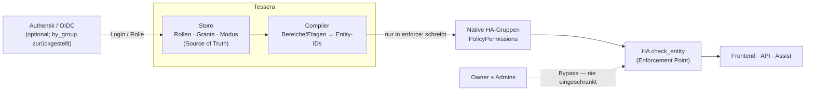
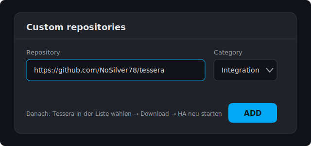
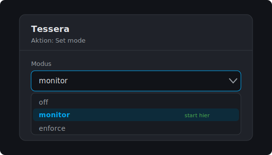
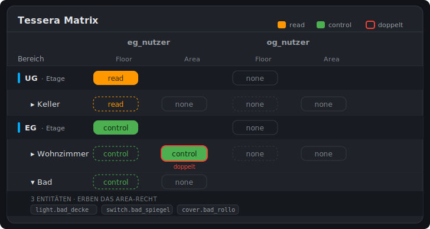
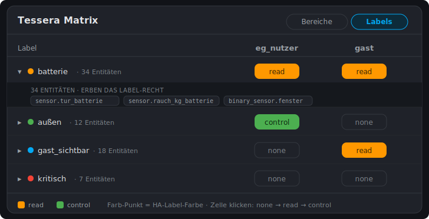
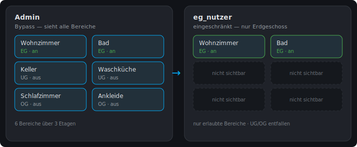

<!-- Sprache: Deutsch. English version: GUIDE.md -->

# Tessera — Einrichtung & Nutzung

> Rollenbasierte Zugriffskontrolle (RBAC) für Home Assistant — **Read / Control × Rolle × Bereich**, durchgesetzt über **native** HA-Berechtigungen.

**Deutsch** · [English](GUIDE.md)

[](https://github.com/NoSilver78/tessera)
[](https://github.com/NoSilver78/tessera/releases)
[](#voraussetzungen)
[](../LICENSE)

> [!WARNING]
> Tessera verändert, **wer** in deiner Home-Assistant-Instanz **was** sehen und tun darf. Im Modus
> `enforce` **schreibt Tessera aktiv** in den HA-Auth-Store. Lies den Abschnitt
> [Was zu beachten ist](#was-zu-beachten-ist) **bevor** du `enforce` aktivierst — und **beginne mit
> `monitor`**, prüfe die berechneten Rechte, und wechsle erst dann bewusst zu `enforce`.

---

## Inhalt

- [Was Tessera ist & für wen](#was-tessera-ist--für-wen)
- [Wie sich Tessera zu Alternativen verhält](#wie-sich-tessera-zu-alternativen-verhält)
- [Architektur & Datenfluss](#architektur--datenfluss)
- [Voraussetzungen](#voraussetzungen)
- [Installation](#installation)
- [Erste Einrichtung & die drei Betriebsmodi](#erste-einrichtung--die-drei-betriebsmodi)
- [Rollen, Grants & Mitgliedschaften](#rollen-grants--mitgliedschaften)
- [Das Admin-Panel „Tessera" (Area-Board)](#das-admin-panel-tessera-area-board)
- [Enforce scharfschalten — mit Preflight](#enforce-scharfschalten--mit-preflight)
- [Was zu beachten ist](#was-zu-beachten-ist)
- [Services & Referenz](#services--referenz)
- [Fehlerbehebung](#fehlerbehebung)
- [FAQ](#faq)
- [Deinstallation & Wiederherstellung](#deinstallation--wiederherstellung)
- [Mitwirken, Sicherheit & Credits](#mitwirken-sicherheit--credits)

---

## Was Tessera ist & für wen

Home Assistant kennt nur **drei feste Systemgruppen** (`system-admin`, `system-users`, `read-only`),
kein UI für feingranulare Rechte und einen harten Owner-Bypass. Sobald mehrere Personen dieselbe
Instanz nutzen — Familie, WG, Gäste, Kinder — fehlt eine Antwort auf „diese Person darf **dieses
Zimmer** sehen, aber nicht **jenes** schalten".

**Tessera** schließt genau diese Lücke. Du vergibst Rechte **pro Rolle × Bereich × Aktion**, und
Tessera kompiliert sie zu **nativen** HA-`PolicyPermissions`. Kein Monkeypatch, kein Core-Fork — nur
das, was Home Assistant selbst durchsetzt.

- **Zwei Aktionsstufen je Zelle:** `read` (ansehen) und `control` (bedienen). `control` schließt `read` ein.
- **Allow-only:** eine Regel *gewährt* Zugriff; nicht Gewährtes bleibt verwehrt. Es gibt **keine**
  Deny-Regeln, und Owner- sowie systemerzeugte Konten werden **nie** verändert.
- **Bereiche als Pflege-Ebene:** du arbeitest mit **Bereichen** (Areas) und **Etagen** (Floors);
  Tessera expandiert sie zu den konkreten Entitäten — inklusive der bereichslosen Direkt-Entitäten,
  die HAs `area_id`-Auflösung allein verfehlt.

**Für wen:** Home-Assistant-Administratoren mit HACS-Erfahrung, die feingranulare, nachvollziehbare
Rechte wollen — sicherheitsbewusst, aber ohne die HA-Auth-Interna kennen zu müssen.

> [!NOTE]
> Tessera ist **keine** vollständige Daten-Isolation für hochsensible Mehrmandanten-Szenarien. Es
> nutzt HAs eigene Permission-Schicht; deren dokumentierte Grenzen stehen unter
> [Was zu beachten ist → Bekannte Leak-Pfade](#bekannte-leak-pfade).

---

## Wie sich Tessera zu Alternativen verhält

Tessera ist nicht der erste Versuch, Home Assistant nutzerbezogene Rechte zu geben — der Bedarf ist
real, und andere haben das Thema ebenfalls angegangen. Zwei Alternativen sind im HACS-Store etabliert;
zu verstehen, wie sie sich unterscheiden, hilft bei der Werkzeugwahl.

| | **Durchsetzungs-Mechanismus** | **Scoping-Modell** | **Labels** | **Rollout** |
|---|---|---|---|---|
| **Tessera** | **Native** HA-`PolicyPermissions`, in den Auth-Store geschrieben — **kein Monkeypatch, kein Core-Fork** | **Bereich / Etage als erstklassige Achse** × Rolle × *view / operate / change* | **Lebende Dimension** — bei jedem Compile neu aufgelöst | `off → monitor → enforce`, fail-closed Gate + Snapshot/Restore |
| [`SamAthanas/user-rbac`](https://github.com/SamAthanas/user-rbac) | Middleware, die **Core-Service-Calls abfängt / patcht** (das README weist darauf hin, dass dies bei HA-Updates brechen kann) | Rolle × Domain / Entity, Aktions-Ebene | — | Komponente aktivieren/deaktivieren |
| [`Darkdragon14/ha-access-control-manager`](https://github.com/Darkdragon14/ha-access-control-manager) | Native HA-Gruppen-Permissions | Gruppe × Entity, read / write | Einmal-Bulk-Helfer (später hinzugefügte Entitäten mit demselben Label erben laut README **nicht** automatisch) | direkte Gruppen-Edits |

**Was Tessera abhebt:**

- **Kein Core-Patching.** Da Rechte in HAs *native* Gruppen-`PolicyPermissions` kompiliert werden,
  kehrt HA beim Deaktivieren von Tessera in den Auslieferungszustand zurück — es gibt keine
  Abfang-Schicht, die ein Core-Update brechen kann, und nichts von Hand zurückzudrehen.
- **Bereich / Etage als primäre Achse.** Du vergibst so, wie du über dein Haus denkst; die
  Entity-Detailebene ist beim Aufklappen verfügbar, aber nicht die Arbeitseinheit.
- **Labels bleiben lebendig.** Ein Label-Grant wird bei jedem Compile neu aufgelöst; eine später
  getaggte Entität ist automatisch abgedeckt, ohne den Grant erneut anzufassen.
- **Monitor-first-Sicherheit.** Du beobachtest die berechneten Verdikte im `monitor`-Modus, bevor je
  etwas geschrieben wird — hinter einer fail-closed Gate-Sequenz (Version-Guard → Compile → D9-Gate →
  Linter → Lockout-Precheck → unveränderlicher Snapshot → Apply), mit automatischer Wiederherstellung
  bei jedem Fehler.

Das ist eine Einordnung, kein Urteil: `user-rbac` ist populär und ausgereift, wenn du simples
Aktions-Blocken willst und eine Abfang-Schicht akzeptierst; `ha-access-control-manager` passt, wenn du
HA-Gruppen ohnehin von Hand pflegst. Tessera zielt auf **bereichszentrische, deklarative Rechte, die in
native HA-Permissions kompiliert werden — mit einem sicheren, monitor-first Rollout.**

---

## Architektur & Datenfluss

Tessera folgt dem klassischen RBAC-Modell (Policy-Verwaltung → Entscheidung → Durchsetzung):



- **Store** = die Quelle der Wahrheit (Rollen, Grants, Mitgliedschaften, Modus).
- **Compiler** = übersetzt Bereiche/Etagen in konkrete Entity-IDs und baut die native Policy.
- **Native HA-Gruppen** = das kompilierte Ergebnis, das HA selbst durchsetzt (`check_entity`).
- Die Durchsetzung ist **netzpfad-agnostisch**: sie greift lokal wie über einen Reverse-Proxy/Tunnel,
  weil der Enforcement-Point in HA-Core sitzt.

---

## Voraussetzungen

> [!IMPORTANT]
> Für `enforce` ist eine **validierte Home-Assistant-Feature-Linie** erforderlich. Tessera schreibt
> über teils **private HA-Auth-APIs** ohne Stabilitätsgarantie und prüft die Version auf der
> `YEAR.MONTH`-Feature-Linien-Ebene — der Ebene, auf der HA Auth-Store-Breaking-Changes ausliefert.
> Jedes **Patch** innerhalb der validierten Linie wird akzeptiert; auf einem **anderen Monats-Release**
> blockiert der Schreibpfad **fail-closed** und Tessera bleibt im read-only `monitor`. Details:
> [Versions-Guard](#der-versions-guard-und-ha-updates).

| Voraussetzung | Wert / Hinweis |
|---|---|
| Home Assistant (für `enforce`) | **die 2026.7-Linie** (2026.7.x, `SUPPORTED_HA_AUTH_FEATURE`; validiert auf 2026.7.1) |
| Home Assistant (für `off`/`monitor`) | jede Version — `monitor` ist read-only und schreibt nie |
| HACS | installiert (für die Installation als Custom-Repository) |
| Zugriff | **Administrator** (Panel, Optionen und Services sind admin-only) |
| Testkonto | ein **Nicht-Admin**-Konto zum Prüfen (Admins werden per Bypass nie eingeschränkt) |

---

## Installation

Tessera wird als **HACS Custom Repository** installiert. (Die Aufnahme in den HACS-Default-Store ist
eingereicht; bis dahin gilt der folgende Weg.)

1. **HACS** öffnen → Drei-Punkte-Menü oben rechts → **Custom repositories**.
2. Repository-URL `https://github.com/NoSilver78/tessera` eintragen, Kategorie **Integration**
   wählen, **ADD**.

   

3. In der HACS-Liste **Tessera** auswählen → **Download**.
4. **Home Assistant neu starten.**

   > [!NOTE]
   > Der Neustart ist eigenständig nötig — HACS lädt nur die Dateien; geladen wird die Integration
   > erst nach dem Neustart.

5. **Einstellungen → Geräte & Dienste → Integration hinzufügen → „Tessera"** auswählen.

Danach erscheint **Tessera** in der Seitenleiste (nur für Administratoren) und unter Geräte & Dienste.

---

## Erste Einrichtung & die drei Betriebsmodi

Tessera kennt drei Modi. **Der Standard ist nicht-eingreifend — beginne mit `monitor`.**

| Modus | Wirkung |
|---|---|
| `off` | Tessera tut nichts. |
| `monitor` | Tessera **berechnet** die Rechte und zeigt Abweichungen (Panel + Logs), **schreibt aber nichts** in den Auth-Store. Sicher zum Einfahren. |
| `enforce` | Tessera **schreibt** die kompilierten Rechte aktiv in den HA-Auth-Store (native Gruppen-`PolicyPermissions` + Rebind der `group_ids`) und greift real in Zugriffe ein. |

**Modus setzen** — über die Konfigurationsseite:

1. **Einstellungen → Geräte & Dienste → Tessera → Konfigurieren.**
2. Aktion **Set mode** wählen.
3. Modus `monitor` (Start) auswählen und bestätigen.



> [!TIP]
> Der Modus lässt sich auch per Aktion `tessera.set_mode` setzen (z. B. für Automationen) — siehe
> [Services & Referenz](#services--referenz).

---

## Rollen, Grants & Mitgliedschaften

Das Modell besteht aus drei Bausteinen. Alle werden über **Tessera → Konfigurieren** (Options-Flow)
oder Services gepflegt — **nie** über `configuration.yaml`.

### 1. Rollen

Eine **Rolle** bündelt Rechte (z. B. `eg_nutzer`, `og_nutzer`, `gast`). Anlegen: Konfigurieren →
**Add role** (`role_id`, Name, Beschreibung).

> [!NOTE]
> Das Flag **`is_admin`** (das eine Rolle auf HAs globales `is_admin` = die `change`-Stufe hebt) ist
> **kein** Feld im „Add role"-Dialog. Es wird ausschließlich über die Aktion `tessera.import`
> (Feld `roles`) bzw. den Store gesetzt — bewusst, weil es die stärkste Stufe ist.

### 2. Grants (die eigentliche Rechtevergabe)

Ein **Grant** verknüpft **Bereich/Etage × Rolle** mit `read` und/oder `control`:

| Ebene | Womit | Wirkung |
|---|---|---|
| **Area-Grant** | Panel-Klick oder `add_area_grant` | Rechte für **einen Bereich** (primär, ~90 % der Pflege) |
| **Floor-Grant** | Panel-Klick oder `tessera.set_floor_grant` | Rechte für die **ganze Etage** (alle Bereiche darauf) |
| **Label-Grant** | Labels-Board-Klick oder `tessera.set_label_grant` | additive Rechte für **alles, was ein Label auflöst** (Entität + Gerät + Bereich) |
| **Entity-Override** | `tessera.import` (`entity_overrides`) | additive Einzel-Entity-Rechte |

Wirkung der Stufen je Rolle:

| Stufe | Bedeutung | Entspricht |
|---|---|---|
| `read` | Zustand ansehen | — |
| `control` | ansehen **und** bedienen | schließt `read` ein |
| `change` | globale Admin-Rechte | HAs `is_admin` (nicht bereichsscoped) |

**Label-Grants** sind die querschnittliche Dimension: Ein Label ist ein Tag, das du *quer* durchs Haus
vergibst — ein Label-Grant schneidet also durch Etagen und Bereiche. Ein Label-Grant erfasst die
**Vereinigung** aus — Entitäten, die das Label direkt tragen **+** Entitäten von *Geräten* mit dem Label
**+** Entitäten von *Bereichen* mit dem Label (genau so, wie Home Assistant selbst ein Label-Target
auflöst). Wie jeder Grant ist er additiv/allow-only, und `control` schließt `read` ein. Setzen im
**Labels-Board** (siehe [Panel](#das-admin-panel-tessera-area-board)) oder per `tessera.set_label_grant`
/ `tessera.import` (`label_grants`).

> [!TIP]
> Ein Label ist das richtige Werkzeug für ein Anliegen, das **über Räume hinweg** gilt — z. B. ein
> `security`-Label an jeder Kamera, jedem Schloss und Türsensor, mit `read` für eine `gast`-Rolle —
> statt einzelne Entity-Overrides zusammenzuklauben. Das Label muss in HA bereits existieren: unter
> **Einstellungen → Labels** anlegen/zuweisen (oder in den Entitäten-/Geräte-Tabellen mehrfach
> zuweisen), erst dann in Tessera darüber granten.

> [!CAUTION]
> Ein Label-Grant kann **deutlich breiter sein, als er aussieht**: Geräte- und Bereichs-Vererbung ziehen
> weit mehr Entitäten hinein, als buchstäblich getaggt sind. **Klappe die Label-Zeile im Panel (Monitor)
> auf und lies die aufgelöste Entitäten-Zahl, bevor du scharf schaltest.**

### 3. Mitgliedschaften

Eine **Mitgliedschaft** ordnet einen **HA-Nutzer** einer oder mehreren Rollen zu (`by_user`).
Setzen per Aktion `tessera.set_membership` (`user_id`, `role_ids`).

> [!TIP]
> Die `user_id` findest du unter **Einstellungen → Personen → Benutzer → [Nutzer]** in der URL
> (`/config/users/<user_id>`). Nutzer **ohne** Zuordnung erhalten die interne Default-Rolle
> (allow-nothing) — sie sehen also nichts, statt versehentlich alles.

> [!NOTE]
> `by_group` (Rollen aus Authentik/OIDC-Gruppen) ist **zurückgestellt**. Aktuell gilt `by_user` per
> `user_id`. Zum OIDC-Setup siehe [FAQ](#faq).

Das ganze Modell lässt sich auch in **einem** idempotenten Aufruf provisionieren — siehe
[`tessera.import`](#services--referenz).

---

## Das Admin-Panel „Tessera" (Area-Board)

In der Seitenleiste erscheint (nur für Administratoren) die Seite **Tessera**. Ein Umschalter oben,
**`Bereiche ↔ Labels`**, wechselt zwischen zwei Boards: dem **Area-Board** (Grants nach Etage/Bereich)
und dem **Labels-Board** (Grants nach Label). Zusammen sind sie die zentrale, visuelle Pflege-Oberfläche
für Grants.



**Aufbau:**

- **Zeilen** sind nach **Etage gruppiert**. Je Etage gibt es eine **Kopfzeile** und darunter deren
  **Bereiche** (eingerückt).
- **Je Rolle zwei Spalten:**
  - **Floor** — das von der Etage **geerbte** Recht. Auf der **Etagen-Kopfzeile** ist diese Zelle
    **klickbar** (setzt den Grant der ganzen Etage); auf den Bereich-Zeilen zeigt sie den geerbten
    Wert nur **an** (gestrichelt, nicht editierbar).
  - **Area** — der **direkte** Bereich-Grant, **klickbar**.
- **Grant per Klick** — jede editierbare Zelle zykelt: `none → read → read+control → none`.
- **„doppelt"** markiert eine Zelle, deren Bereich zusätzlich gewährt, was die Etage schon gibt
  (redundant, kein Fehler).
- **Aufklappen** (Chevron an der Bereich-Zeile) listet die von Tessera aufgelösten **Entitäten** des
  Bereichs — sie erben das Bereich-Recht und haben daher keine eigenen Wertespalten.

**Das Labels-Board** (Umschalter → **Labels**) listet deine Home-Assistant-**Labels** als Zeilen, je mit
einem Farb-Punkt (die HA-Farbe des Labels) und der Zahl der aufgelösten Entitäten. Je Rolle gibt es eine
editierbare Zelle, die `none → read → read+control → none` zykelt; klappt man eine Label-Zeile auf,
erscheinen genau die Entitäten, die der Grant abdeckt — oft über mehrere Etagen und Bereiche hinweg.
Labels werden **zuerst in HA getaggt**; Tessera grantet nur über bestehende.



> [!TIP]
> Oben zeigt das Panel eine **Vorschau** (Rollen, Entitäten, Read-/Control-Grants) — im `monitor`
> ist das die risikofreie Kontrolle, ob dein Modell das Gewünschte ergibt, **bevor** du scharf
> schaltest.

---

## Enforce scharfschalten — mit Preflight

> [!IMPORTANT]
> `enforce` schreibt real in den HA-Auth-Store. Führe **zuerst** den Preflight aus und lies
> [Was zu beachten ist](#was-zu-beachten-ist).

### Schritt 1 — Preflight (read-only)

Führe die Aktion **`tessera.preflight`** aus (Entwicklerwerkzeuge → Aktionen, „Antwort abrufen").
Sie ändert **nichts** und liefert:

- `would_enforce_succeed` — ob `enforce` gelingen würde,
- `blocked_reason` / `blocked_detail` — was ggf. blockt,
- `d9` — Klassifikation installierter Custom-Components (siehe [D9-Gate](#das-d9-gate)),
- `lint` — Konflikte im Modell,
- `model` — Rollen/Grants/Mitgliedschaften + kompilierte Entitätszahlen.

Erst wenn `would_enforce_succeed: true` und `blocked_reason: null` sind, ist alles bereit.

### Schritt 2 — Die fail-closed Gate-Sequenz

Beim Umschalten auf `enforce` durchläuft Tessera eine Kette, die bei **jedem** Fehler sicher auf
`monitor` zurückfällt (kein Halbzustand):

```
Version → Resolver/Store → Compile → D9-Gate → Linter → Lockout-Precheck → Snapshot → Apply
```

### Schritt 3 — Scharf schalten

**Tessera → Konfigurieren → Set mode → `enforce`** (oder Aktion `tessera.set_mode` mit `mode: enforce`).

Der „Money-Shot" eines RBAC-Produkts — dasselbe Dashboard, einmal als Admin (voll), einmal als
eingeschränkter Nutzer (gefiltert):



### Schritt 4 — Verifizieren

Melde dich mit dem **Nicht-Admin-Testkonto** an: es sollte nur die erlaubten Bereiche/Entitäten
sehen und bedienen können. `tessera.preflight` sollte weiterhin `mode: enforce` melden, und in
**Einstellungen → System → Reparaturen** darf **keine** Tessera-Meldung stehen.

---

## Was zu beachten ist

Der wichtigste Abschnitt. Bitte vor dem Produktivbetrieb lesen.

### Der Versions-Guard und HA-Updates

> [!IMPORTANT]
> Tessera schreibt über **private/undokumentierte HA-Auth-APIs**. Ein Laufzeit-Guard
> (`SUPPORTED_HA_AUTH_FEATURE`) erlaubt den Schreibpfad auf der validierten HA-**Feature-Linie**
> (aktuell **2026.7**, d. h. jedes **2026.7.x**-Patch; validiert auf **2026.7.1**). HA liefert
> Auth-Store-Breaking-Changes nur in der Monats-Linie aus, daher funktionieren Patch-Updates weiter,
> und nur ein **neues Monats-Release** pausiert `enforce`.

**Was bei einem HA-Monats-Update passiert** (erwartet und sicher):

1. Nach einem HA-Update auf eine **neue Monats-Linie** passt die Feature-Linie nicht mehr → der
   Schreibpfad wird **fail-closed blockiert** → Tessera fällt auf `monitor` zurück und legt die
   Reparatur **„Tessera fell back to monitor mode"** an. (Ein Patch innerhalb der validierten Linie
   behält `enforce`.)
2. **Die bereits angewandte Durchsetzung bleibt bestehen** — die nativen `tessera:*`-Gruppen liegen
   im HA-Auth-Store und überleben den Neustart. Deine Bewohner bleiben also eingeschränkt; Tessera
   verwaltet nur nicht mehr aktiv.
3. Der Fallback **persistiert den Modus auf `monitor`**. Nach dem Anheben des Guards musst du
   `enforce` daher **explizit neu setzen**.
4. Sobald eine neue Tessera-Version die neue HA-Version verifiziert + freigibt: aktualisieren, dann
   `enforce` erneut setzen (idempotent — keine Unterbrechung).

> [!NOTE]
> Praktisch heißt das: **jedes HA-Core-Update pausiert `enforce` sicher**, bis Tessera nachzieht. Das
> ist der bewusste Sicherheits-Kompromiss der Private-API-Abhängigkeit.

### Owner- & Admin-Bypass

> [!WARNING]
> Home-Assistant-**Owner** und **Administratoren** unterliegen Tessera **nicht** — sie sehen und
> schalten immer alles. Wer eingeschränkt werden soll, darf **kein** Admin sein. Zum Testen der
> Einschränkung brauchst du ein **Nicht-Admin**-Konto.

### Allow-only

Tessera vergibt **nur** Rechte (additiv). Es gibt keine Deny-Regeln; Tessera hebelt keine HA-eigenen
Admin-Rechte aus. Überlappen Etage und Bereich, ist das Ergebnis die **Vereinigung** (im Panel als
„doppelt" markiert).

### Label-Breite & Vererbung

Ein **Label-Grant** löst über Entität **+** Gerät **+** Bereich auf, sein Scope ist also mindestens das
Getaggte und oft mehr. Read-lastige Label-Scopes wirken zudem mit den
[bekannten Leak-Pfaden](#bekannte-leak-pfade) unten zusammen. Vor dem Scharfschalten: **Label-Zeile im
Panel (Monitor) aufklappen** und die aufgelöste Entitäten-Zahl lesen. Labels werden zuerst in HA
getaggt — Tessera grantet ein bestehendes Label, es erstellt keines.

### Bekannte Leak-Pfade

HA-Permissions wirken **nicht** auf jeder Oberfläche identisch. Diese HA-internen Pfade kann Tessera
**nicht** schließen — hier ehrlich benannt:

> [!CAUTION]
> - **`render_template` / Template-Sensoren** können Zustände von Entitäten lesen, auf die ein
>   Nutzer per UI keinen Zugriff hat — Werte können indirekt durchsickern.
> - **Logbook / History** können je nach HA-Version Ereignisse eingeschränkter Entitäten zeigen.
> - **Assist / Conversation** können Zustände abfragen oder Aktionen auslösen, die die
>   Permission-Schicht teilweise umgehen.
>
> Sind diese Pfade für dich relevant, ergänze HA-seitige Maßnahmen (Entitäten aus Assist ausschließen,
> Template-Exposition begrenzen).

### Das D9-Gate

Installierte Custom-Components mit **auth-mutierenden** Flächen (z. B. ein OIDC-Provider) blocken
`enforce` **fail-closed**, bis ein Admin sie bewusst bestätigt (`tessera.acknowledge_component`,
gebunden an Domain + Version + Content-Hash). Generische Komponenten laufen per Default durch. Der
Preflight listet unter `d9` alle Verdikte.

### Fallback-Gründe

`tessera.preflight` / die Reparatur nennen einen Grund, warum `enforce` nicht (oder nicht mehr) läuft:

| `blocked_reason` / `refused_reason` | Bedeutung | Abhilfe |
|---|---|---|
| `version` | HA-Version ≠ getestete Version | Auf passende Tessera-Version warten/aktualisieren |
| `d9` | eine Custom-Component blockt (auth-Fläche, nicht ge-ackt) | Komponente prüfen und ggf. `acknowledge_component` |
| `lockout` | Apply würde Owner/Admin aussperren | Modell korrigieren (Precheck verhindert den Write) |
| `allow-only` | eine Policy-Form verletzt allow-only | Modell/Import prüfen |
| `write-error` | Schreibfehler am Auth-Store | Logs prüfen; Tessera bleibt fail-safe auf `monitor` |

---

## Services & Referenz

Alle Services sind **admin-only**. Modus- und Grant-ändernde Services laufen über den geschützten,
fail-safe-to-monitor Pfad.

| Service | Felder | Zweck |
|---|---|---|
| `tessera.set_mode` | `mode` (`off`/`monitor`/`enforce`, Pflicht) | Betriebsmodus setzen |
| `tessera.preflight` | — (liefert Antwort) | read-only Enforce-Readiness (Verdikt, D9, Linter, Modell) |
| `tessera.recompile` | — | alle Einträge im aktuellen Modus neu kompilieren (in `enforce`: nativer Re-Apply) |
| `tessera.set_membership` | `user_id` (Pflicht), `role_ids` (Objekt/Liste, Pflicht) | Nutzer → Rolle(n) zuordnen |
| `tessera.set_floor_grant` | `floor_id`, `role_id`, `read`, `control` (alle Pflicht) | Etagen-Grant setzen |
| `tessera.set_label_grant` | `label_id`, `role_id`, `read`, `control` (alle Pflicht) | Label-Grant setzen/entfernen |
| `tessera.acknowledge_component` | `domain` (Pflicht) | eine D9-blockende Component freigeben |
| `tessera.revoke_component_ack` | `domain` (Pflicht) | eine D9-Freigabe zurücknehmen |
| `tessera.import` | `roles`, `memberships`, `area_grants`, `floor_grants`, `label_grants`, `entity_overrides` (alle Objekt, optional) | ganzes Modell in **einem** idempotenten Aufruf provisionieren (bereitgestellt = ersetzt, weggelassen = bleibt) |

> [!TIP]
> `tessera.import` ist der schnellste Weg, ein komplettes Haushaltsmodell aufzusetzen oder
> versioniert (z. B. aus einem Skript) zu pflegen. `is_admin` je Rolle wird hier über `roles` gesetzt.

Area-Grants selbst werden im Panel per Klick gesetzt (WebSocket `tessera/matrix/set_grant`) bzw. über
den Options-Flow (**Add area grant** / **Remove area grant**). Floor- und Label-Grants werden an ihren
Panel-Zellen gesetzt (`tessera/matrix/set_floor_grant` / `set_label_grant`) oder über die passenden
Services — der Options-Flow deckt derzeit nur Area-Grants ab.

### Konfigurationsreferenz — wo welche Einstellung lebt

Tessera wird über den **Options-Flow** (Konfigurieren), das **Panel**, **Services** oder `tessera.import`
konfiguriert — **nie** über `configuration.yaml`. Diese Übersicht bildet jede Einstellung auf ihren
Setz-Weg ab und markiert, was heute **keinen Klick-Weg** hat und einen Service bzw. `import` braucht:

| Einstellung | Options-Flow | Panel | Service | `import` |
|---|:---:|:---:|:---:|:---:|
| Betriebs-`mode` | ✅ Set mode | — | `set_mode` | — |
| Rolle anlegen / löschen | ✅ Add/Remove role | — | — | ✅ `roles` |
| Rollen-**Name** / Beschreibung | ✅ | — | — | ✅ `roles` |
| Rollen-**`is_admin`** (die `change`-Stufe) | ❌ | ❌ | ❌ | ✅ `roles` |
| **Area-Grant** | ✅ Add/Remove area grant | ✅ Area-Zelle | — | ✅ `area_grants` |
| **Floor-Grant** | ❌ | ✅ Floor-Zelle | `set_floor_grant` | ✅ `floor_grants` |
| **Label-Grant** | ❌ | ✅ Labels-Board | `set_label_grant` | ✅ `label_grants` |
| **Entity-Override** | ❌ | ❌ | ❌ | ✅ `entity_overrides` |
| **Mitgliedschaft** (Nutzer → Rollen) | ❌ | ❌ | `set_membership` | ✅ `memberships` |
| D9-Freigabe | ❌ | ❌ | `acknowledge_component` / `revoke_component_ack` | — |

> [!NOTE]
> **Aktuelle Klick-UI-Lücken (Roadmap).** Drei Einstellungen haben noch keinen Klick-Weg und werden per
> `tessera.import` (oder den genannten Service) gesetzt: **`is_admin`** (bewusst — es ist die stärkste
> Stufe), **Entity-Overrides** (der einzige Einzel-Entity-Regler — nur `import`) und
> **Nutzer→Rollen-Mitgliedschaften** (`tessera.set_membership` oder `import`). Das Modell *setzt* alle
> drei voll durch; nur die Editier-UI fehlt noch. Zwei Store-Felder sind bewusst **inert**:
> `membership.by_group` (OIDC-Gruppe→Rolle, zurückgestellt — v1 nutzt `by_user`) und `policy.staging`
> (reservierter interner Puffer). Beide zu setzen hat heute keine Wirkung.

---

## Fehlerbehebung

### „Tessera fell back to monitor mode" (Reparatur)

Der Enforce-Pfad ist fail-closed auf `monitor` zurückgefallen. Häufigste Ursache nach einem
**HA-Update**: der [Versions-Guard](#der-versions-guard-und-ha-updates). Führe `tessera.preflight`
aus und lies `blocked_reason`:

- `version` → HA-Version passt nicht. Die native Durchsetzung besteht fort; warte auf eine
  Tessera-Version für deine HA-Version, aktualisiere, dann setze `enforce` **explizit** neu.
- `d9` → siehe [D9-Gate](#das-d9-gate).
- sonst → siehe [Fallback-Gründe](#fallback-gründe).

### „Konfigurieren" zeigt kein Modus-Menü / öffnet das Panel

Ab **v0.8.1** öffnet **Konfigurieren** den Options-Flow (mit **Set mode**), das Panel liegt in der
Seitenleiste. Bei älteren Versionen aktualisiere Tessera — oder setze den Modus übergangsweise per
Aktion `tessera.set_mode`.

### Ein Nutzer sieht weiterhin alles

Prüfe der Reihe nach:

1. Ist der Nutzer **Admin/Owner**? Dann greift der **Bypass** — er wird nie eingeschränkt.
2. Ist der Modus wirklich `enforce`? (`tessera.preflight` → `mode`).
3. Hat der Nutzer eine **Mitgliedschaft**? (ohne Rolle: Default = allow-nothing).
4. Nach Modelländerungen ggf. `tessera.recompile` ausführen.

### Änderungen wirken nicht

In `monitor` schreibt Tessera **nichts** — Änderungen sind erst im Panel/Preview sichtbar, aber
nicht durchgesetzt. Für echte Wirkung: `enforce`.

### Ein Label-Grant trifft mehr (oder weniger) Entitäten als erwartet

Ein Label-Grant expandiert über die **Entitäten + deren Geräte + deren Bereiche** des Labels. Klappe die
Label-Zeile im Panel (Monitor) auf, um die exakt aufgelöste Menge zu sehen. Ist sie leer, ist dem Label
noch nichts zugewiesen — tagge Entitäten/Geräte/Bereiche zuerst in HA (**Einstellungen → Labels** oder
die Mehrfachzuweisung in den Entitäten-/Geräte-Tabellen).

---

## FAQ

**Werden meine Nutzer eingeschränkt, wenn ich HA update?**
Sie bleiben eingeschränkt (die native Durchsetzung überlebt das Update), aber Tessera pausiert die
aktive Verwaltung, bis der Versions-Guard nachgezogen ist. Siehe
[Versions-Guard](#der-versions-guard-und-ha-updates).

**Funktioniert das über meinen Reverse-Proxy / Cloudflare-Tunnel?**
Ja — die Durchsetzung sitzt im HA-Core (`check_entity`) und ist netzpfad-agnostisch.

**Wie richte ich es mit Authentik/OIDC-Nutzern ein?**
Bewohner melden sich via OIDC an und existieren dann als HA-Nutzer. Ordne sie per `user_id`
(`by_user`) zu — Etagen-/Bereichsrollen liegen komplett bei Tessera; Authentik braucht dafür keine
Gruppen. **Wichtig:** Bewohner **nicht** in die Authentik-`admins`-Gruppe, sonst greift der
HA-Admin-Bypass.

**Kann ich einzelne Entitäten statt ganzer Bereiche freigeben?**
Ja, additiv über `entity_overrides` (via `tessera.import`).

**Kann ich ein Recht vergeben, das über Räume hinweg gilt (z. B. alle Kameras)?**
Ja — ein **Label-Grant**. Tagge die Entitäten/Geräte mit einem Home-Assistant-Label und vergib dann
`read`/`control` auf dieses Label (Labels-Board oder `tessera.set_label_grant`). Das Label muss in HA
bereits existieren.

**Werden Daten in die Cloud gesendet?**
Nein. Tessera arbeitet **rein lokal** (HA-Auth-Store + eigener Store), keine Cloud, keine Telemetrie.

---

## Deinstallation & Wiederherstellung

> [!CAUTION]
> **Erst entschärfen, dann entfernen.** Setze den Modus auf `off` bzw. `monitor`, **solange Tessera
> noch läuft** — dann stellt Tessera den Pre-Install-Zustand des Auth-Stores wieder her (entfernt die
> `tessera:*`-Gruppen und bindet die Nutzer zurück). Entfernst du die Integration im `enforce`, wird
> beim Entladen ebenfalls wiederhergestellt; ein sauberer Modus-Wechsel vorher ist trotzdem der
> verlässlichste Weg.

1. **Tessera → Konfigurieren → Set mode → `monitor`** (oder `off`).
2. Prüfen, dass die Einschränkungen weg sind (Nicht-Admin-Testkonto).
3. Integration unter **Geräte & Dienste** entfernen, danach in **HACS** löschen.
4. **Home Assistant neu starten.**

---

## Mitwirken, Sicherheit & Credits

- **Mitwirken:** besonders willkommen sind Tests auf vielfältigen Multi-User-Setups und
  HA-Versions-Kompatibilität — siehe [CONTRIBUTING](../CONTRIBUTING.md).
- **Sicherheitslücken:** bitte **nicht** öffentlich als Issue, sondern über GitHub **Private
  Vulnerability Reporting** — siehe [SECURITY](../SECURITY.md).
- **Entwicklungsmodell:** jeder Auth-Schreibpfad durchläuft vor dem Merge ein adversariales
  Mehr-Agenten-Gate plus Mutationsproben — offen einsehbar in [`reports/`](../reports) und
  [`exchange/`](../exchange).
- **Lizenz:** [MIT](../LICENSE) © 2026 Michael Scholz.
