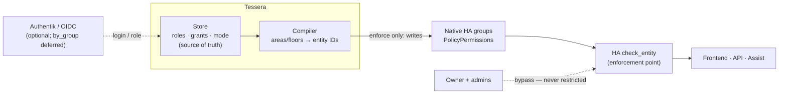
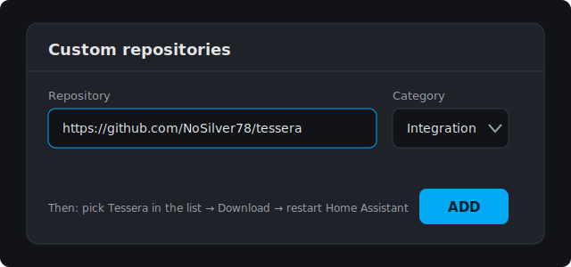
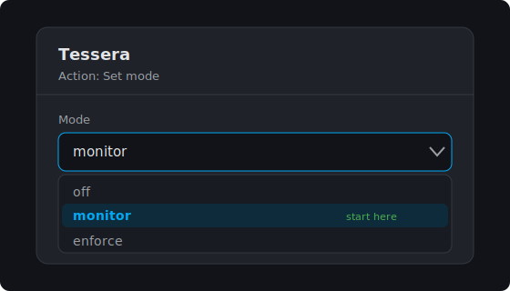
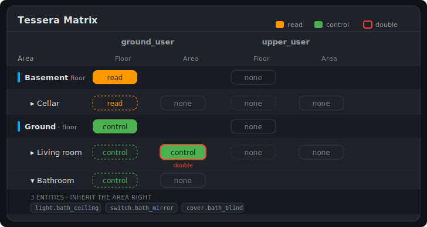
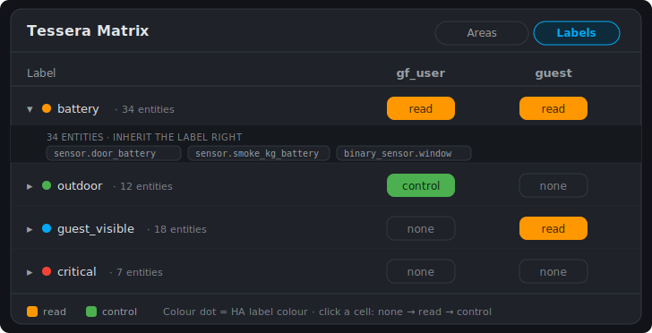
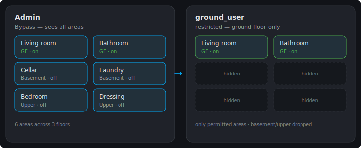

<!-- Language: English. Deutsche Version: GUIDE.de.md -->

# Tessera — Setup & Usage

> Role-based access control (RBAC) for Home Assistant — **Read / Control × Role × Area**, enforced through **native** HA permissions.

[Deutsch](GUIDE.de.md) · **English**

[](https://github.com/NoSilver78/tessera)
[](https://github.com/NoSilver78/tessera/releases)
[](#prerequisites)
[](../LICENSE)

> [!WARNING]
> Tessera changes **who** can see and do **what** in your Home Assistant instance. In `enforce` mode
> Tessera **actively writes** to the HA auth store. Read [Things to watch out for](#things-to-watch-out-for)
> **before** you enable `enforce` — and **start with `monitor`**, review the computed permissions, and
> only then move deliberately to `enforce`.

---

## Contents

- [What Tessera is & who it's for](#what-tessera-is--who-its-for)
- [How Tessera compares to alternatives](#how-tessera-compares-to-alternatives)
- [Architecture & data flow](#architecture--data-flow)
- [Prerequisites](#prerequisites)
- [Installation](#installation)
- [First setup & the three modes](#first-setup--the-three-modes)
- [Roles, grants & memberships](#roles-grants--memberships)
- [The "Tessera" admin panel (Area-Board)](#the-tessera-admin-panel-area-board)
- [Going to enforce — with preflight](#going-to-enforce--with-preflight)
- [Things to watch out for](#things-to-watch-out-for)
- [Services & reference](#services--reference)
- [Troubleshooting](#troubleshooting)
- [FAQ](#faq)
- [Uninstall & restore](#uninstall--restore)
- [Contributing, security & credits](#contributing-security--credits)

---

## What Tessera is & who it's for

Home Assistant only has **three fixed system groups** (`system-admin`, `system-users`, `read-only`),
no UI for fine-grained rights, and a hard owner bypass. The moment several people share one instance —
family, flatmates, guests, kids — there is no answer to "this person may see **this room** but not
control **that one**".

**Tessera** closes exactly that gap. You assign rights **per role × area × action**, and Tessera
compiles them into **native** HA `PolicyPermissions`. No monkeypatch, no core fork — only what Home
Assistant enforces itself.

- **Two action levels per cell:** `read` (view) and `control` (operate). `control` implies `read`.
- **Allow-only:** a rule *grants* access; anything not granted stays denied. There are **no** deny
  rules, and owner / system-generated accounts are **never** modified.
- **Areas as the maintenance layer:** you work with **areas** and **floors**; Tessera expands them to
  the concrete entities — including the area-less direct entities that HA's `area_id` resolution alone
  misses.

**Who it's for:** Home Assistant administrators with HACS experience who want fine-grained,
auditable rights — security-conscious, but without needing to know HA's auth internals.

> [!NOTE]
> Tessera is **not** full data isolation for high-sensitivity multi-tenant scenarios. It uses HA's own
> permission layer; its documented limits are under
> [Things to watch out for → Known leak paths](#known-leak-paths).

---

## How Tessera compares to alternatives

Tessera is not the first attempt to bring per-user rights to Home Assistant — the need is real and
others have tackled it. Two alternatives are established in the HACS store; understanding how they
differ helps you pick the right tool.

| | **Enforcement mechanism** | **Scoping model** | **Labels** | **Rollout** |
|---|---|---|---|---|
| **Tessera** | **Native** HA `PolicyPermissions` written into the auth store — **no monkeypatch, no core fork** | **Area / Floor as a first-class axis** × role × *view / operate / change* | **Living dimension** — re-resolved on every compile | `off → monitor → enforce`, fail-closed gate + snapshot/restore |
| [`SamAthanas/user-rbac`](https://github.com/SamAthanas/user-rbac) | Middleware that **intercepts / patches core service calls** (its README notes this may break on HA updates) | role × domain / entity, action-level | — | enable/disable component |
| [`Darkdragon14/ha-access-control-manager`](https://github.com/Darkdragon14/ha-access-control-manager) | Native HA group permissions | group × entity, read / write | one-shot bulk helper (later entities with the same label do **not** inherit automatically, per its README) | direct group edits |

**What sets Tessera apart:**

- **No core patching.** Because rights compile into HA's *native* group `PolicyPermissions`, disabling
  Tessera returns HA to stock behaviour — there is no interception layer that a core update can break,
  and nothing to unwind by hand.
- **Area / floor as the primary axis.** You grant the way you think about your house; entity-level
  detail is available on expand but is not the unit of work.
- **Labels stay live.** A label grant is re-resolved on every compile, so an entity tagged later is
  covered automatically without re-touching the grant.
- **Monitor-first safety.** You watch computed verdicts in `monitor` before anything is ever written,
  behind a fail-closed gate sequence (version guard → compile → D9 gate → linter → lockout precheck →
  immutable snapshot → apply), with automatic restore on any error.

This is a positioning note, not a verdict: `user-rbac` is popular and mature if you want simple
action-blocking and accept an interception layer; `ha-access-control-manager` fits if you already
manage HA groups by hand. Tessera targets **area-centric, declarative rights compiled into native
HA permissions, with a safe monitor-first rollout.**

---

## Architecture & data flow

Tessera follows the classic RBAC model (policy administration → decision → enforcement):



- **Store** = the source of truth (roles, grants, memberships, mode).
- **Compiler** = translates areas/floors into concrete entity IDs and builds the native policy.
- **Native HA groups** = the compiled result that HA itself enforces (`check_entity`).
- Enforcement is **network-path-agnostic**: it applies locally and through a reverse proxy / tunnel
  alike, because the enforcement point lives in HA core.

---

## Prerequisites

> [!IMPORTANT]
> `enforce` requires a **validated Home Assistant feature line**. Tessera writes through partly
> **private HA auth APIs** without a stability guarantee and checks the version at the `YEAR.MONTH`
> feature-line granularity — the level at which HA ships breaking auth-store changes. Any **patch**
> inside the validated line is accepted; on a **different monthly release** the write path is
> **fail-closed** and Tessera stays in read-only `monitor`. See
> [The version guard](#the-version-guard-and-ha-updates).

| Requirement | Value / note |
|---|---|
| Home Assistant (for `enforce`) | **the 2026.7 line** (2026.7.x, `SUPPORTED_HA_AUTH_FEATURE`; validated on 2026.7.1) |
| Home Assistant (for `off`/`monitor`) | any version — `monitor` is read-only and never writes |
| HACS | installed (to install as a custom repository) |
| Access | **administrator** (panel, options and services are admin-only) |
| Test account | a **non-admin** account to verify (admins are never restricted, by bypass) |

---

## Installation

Tessera is installed as a **HACS custom repository**. (Inclusion in the HACS default store has been
submitted; until then, use the path below.)

1. Open **HACS** → three-dot menu top right → **Custom repositories**.
2. Enter the repository URL `https://github.com/NoSilver78/tessera`, choose category **Integration**,
   click **ADD**.

   

3. Select **Tessera** in the HACS list → **Download**.
4. **Restart Home Assistant.**

   > [!NOTE]
   > The restart is a step of its own — HACS only downloads the files; the integration loads only after
   > the restart.

5. **Settings → Devices & Services → Add Integration → "Tessera"**.

Tessera then appears in the sidebar (administrators only) and under Devices & Services.

---

## First setup & the three modes

Tessera has three modes. **The default is non-intrusive — start with `monitor`.**

| Mode | Effect |
|---|---|
| `off` | Tessera does nothing. |
| `monitor` | Tessera **computes** the rights and shows deviations (panel + logs), but **writes nothing** to the auth store. Safe for onboarding. |
| `enforce` | Tessera **writes** the compiled rights into the HA auth store (native group `PolicyPermissions` + rebind of `group_ids`) and really intervenes in access. |

**Set the mode** — via the configuration page:

1. **Settings → Devices & Services → Tessera → Configure.**
2. Choose the action **Set mode**.
3. Select mode `monitor` (to start) and confirm.



> [!TIP]
> The mode can also be set with the `tessera.set_mode` action (e.g. for automations) — see
> [Services & reference](#services--reference).

---

## Roles, grants & memberships

The model has three building blocks. All are maintained through **Tessera → Configure** (options flow)
or services — **never** through `configuration.yaml`.

### 1. Roles

A **role** bundles rights (e.g. `ground_floor_user`, `upstairs_user`, `guest`). Create one via
Configure → **Add role** (`role_id`, name, description).

> [!NOTE]
> The **`is_admin`** flag (which lifts a role to HA's global `is_admin` = the `change` level) is **not**
> a field in the "Add role" dialog. It is set exclusively through the `tessera.import` action (field
> `roles`) or the store — deliberately, because it is the strongest level.

### 2. Grants (the actual rights assignment)

A **grant** links **area/floor × role** with `read` and/or `control`:

| Level | Set via | Effect |
|---|---|---|
| **Area grant** | panel click or `add_area_grant` | rights for **one area** (primary, ~90% of maintenance) |
| **Floor grant** | panel click or `tessera.set_floor_grant` | rights for the **whole floor** (all its areas) |
| **Label grant** | Labels board click or `tessera.set_label_grant` | additive rights for **everything a label resolves to** (entity + its device + its area) |
| **Entity override** | `tessera.import` (`entity_overrides`) | additive per-entity rights |

Meaning of the levels per role:

| Level | Meaning | Equivalent |
|---|---|---|
| `read` | view state | — |
| `control` | view **and** operate | implies `read` |
| `change` | global admin rights | HA's `is_admin` (not area-scoped) |

**Label grants** are the cross-cutting dimension: a label is a tag you apply *across* the house, so a
label grant cuts through floors and areas. A label grant covers the **union** of — entities carrying the
label directly **+** entities of *devices* carrying it **+** entities of *areas* carrying it (mirroring
how Home Assistant itself expands a label target). Like every grant it is additive/allow-only and
`control` implies `read`. Set it on the **Labels board** (see the
[panel](#the-tessera-admin-panel-area-board)) or via `tessera.set_label_grant` / `tessera.import`
(`label_grants`).

> [!TIP]
> A label is the right tool for a concern that **spans rooms** — e.g. a `security` label on every
> camera, lock and door sensor, granted `read` to a `guest` role — instead of hand-picking entity
> overrides. The label must already exist in HA: create/assign it under **Settings → Labels** (or
> bulk-assign in the entity/device tables) first, then grant over it in Tessera.

> [!CAUTION]
> A label grant can be **much broader than it looks**: device + area inheritance can pull in far more
> entities than are literally tagged. **Expand the label row in the panel (monitor mode) and read the
> resolved entity count before you enforce.**

### 3. Memberships

A **membership** maps an **HA user** to one or more roles (`by_user`). Set via the
`tessera.set_membership` action (`user_id`, `role_ids`).

> [!TIP]
> You find the `user_id` under **Settings → People → Users → [user]** in the URL
> (`/config/users/<user_id>`). Users **without** a mapping get the internal default role
> (allow-nothing) — so they see nothing, rather than accidentally everything.

> [!NOTE]
> `by_group` (roles from Authentik/OIDC groups) is **deferred**. Currently `by_user` per `user_id`
> applies. For the OIDC setup see [FAQ](#faq).

The whole model can also be provisioned in **one** idempotent call — see
[`tessera.import`](#services--reference).

---

## The "Tessera" admin panel (Area-Board)

In the sidebar (administrators only) you get the **Tessera** page. A header toggle
**`Bereiche ↔ Labels`** switches between two boards: the **Area-Board** (grants by floor/area) and the
**Labels board** (grants by label). Together they are the central visual maintenance surface for grants.



**Layout:**

- **Rows** are **grouped by floor**. Each floor has a **header row** with its **areas** (indented)
  below.
- **Two columns per role:**
  - **Floor** — the right **inherited** from the floor. On the **floor header row** this cell is
    **clickable** (sets the grant for the whole floor); on the area rows it only **displays** the
    inherited value (dashed, not editable).
  - **Area** — the **direct** area grant, **clickable**.
- **Grant by click** — each editable cell cycles: `none → read → read+control → none`.
- **"doppelt"** (double) marks a cell whose area additionally grants what the floor already grants
  (redundant, not an error).
- **Expand** (chevron on the area row) lists the **entities** Tessera resolves for the area — they
  inherit the area right and therefore carry no value columns of their own.

**The Labels board** (toggle → **Labels**) lists your Home Assistant **labels** as rows, each with a
colour dot (the label's HA colour) and the number of entities it resolves. Per role there is one
editable cell that cycles `none → read → read+control → none`; expanding a label row shows exactly the
entities the grant covers — often spanning several floors and areas. Labels are **tagged in HA first**;
Tessera only grants over existing ones.



> [!TIP]
> At the top the panel shows a **preview** (roles, entities, read/control grants) — in `monitor` this
> is the risk-free way to check that your model produces what you intend, **before** you go live.

---

## Going to enforce — with preflight

> [!IMPORTANT]
> `enforce` really writes to the HA auth store. Run the preflight **first** and read
> [Things to watch out for](#things-to-watch-out-for).

### Step 1 — Preflight (read-only)

Run the **`tessera.preflight`** action (Developer Tools → Actions, "return response"). It changes
**nothing** and returns:

- `would_enforce_succeed` — whether `enforce` would succeed,
- `blocked_reason` / `blocked_detail` — what would block it, if anything,
- `d9` — classification of installed custom components (see [The D9 gate](#the-d9-gate)),
- `lint` — conflicts in the model,
- `model` — roles/grants/memberships + compiled entity counts.

Only when `would_enforce_succeed: true` and `blocked_reason: null` is everything ready.

### Step 2 — The fail-closed gate sequence

When switching to `enforce`, Tessera runs a chain that safely falls back to `monitor` on **any** error
(no half-applied state):

```
Version → Resolver/Store → Compile → D9 gate → Linter → Lockout precheck → Snapshot → Apply
```

### Step 3 — Go live

**Tessera → Configure → Set mode → `enforce`** (or the `tessera.set_mode` action with `mode: enforce`).

The "money shot" of an RBAC product — the same dashboard, once as admin (full), once as a restricted
user (filtered):



### Step 4 — Verify

Sign in with the **non-admin test account**: it should only see/operate the permitted areas/entities.
`tessera.preflight` should still report `mode: enforce`, and **Settings → System → Repairs** must show
**no** Tessera issue.

---

## Things to watch out for

The most important section. Please read before production use.

### The version guard and HA updates

> [!IMPORTANT]
> Tessera writes through **private/undocumented HA auth APIs**. A runtime guard
> (`SUPPORTED_HA_AUTH_FEATURE`) permits the write path on the validated HA **feature line** (currently
> **2026.7**, i.e. any **2026.7.x** patch; validated on **2026.7.1**). HA ships breaking auth-store
> changes only in the monthly line, so patch updates keep working and only a **new monthly release**
> pauses `enforce`.

**What happens on an HA monthly update** (expected and safe):

1. After an HA update to a **new monthly line** the feature line no longer matches → the write path is
   **fail-closed** → Tessera falls back to `monitor` and raises the repair
   **"Tessera fell back to monitor mode"**. (A patch update within the validated line keeps `enforce`.)
2. **The already-applied enforcement persists** — the native `tessera:*` groups live in the HA auth
   store and survive the restart. Your residents stay restricted; Tessera just no longer actively
   manages it.
3. The fallback **persists the mode as `monitor`**. After the guard is raised you therefore have to set
   `enforce` **again explicitly**.
4. Once a new Tessera version verifies + supports the new HA version: update, then set `enforce` again
   (idempotent — no interruption).

> [!NOTE]
> In practice: **every HA core update safely pauses `enforce`** until Tessera catches up. That is the
> deliberate security trade-off of the private-API dependency.

### Owner & admin bypass

> [!WARNING]
> Home Assistant **owners** and **administrators** are **not** subject to Tessera — they always see and
> operate everything. Anyone who should be restricted must **not** be an admin. To test restriction you
> need a **non-admin** account.

### Allow-only

Tessera only grants (additive). There are no deny rules; Tessera never overrides HA's own admin rights.
Where floor and area overlap, the result is their **union** (marked "doppelt" in the panel).

### Label breadth & inheritance

A **label grant** resolves over entity **+** device **+** area, so its scope is at least what's tagged
and often more. Read-heavy label scopes also interact with the [known leak paths](#known-leak-paths)
below. Before enforce, **expand the label row in the panel (monitor)** and read the resolved entity
count. Labels are tagged in HA first — Tessera grants an existing label, it does not create one.

### Known leak paths

HA permissions do **not** act identically on every surface. Tessera **cannot** close these HA-internal
paths — named honestly here:

> [!CAUTION]
> - **`render_template` / template sensors** can read states of entities a user has no UI access to —
>   values can leak indirectly.
> - **Logbook / History** may, depending on HA version, show events of restricted entities.
> - **Assist / Conversation** can query states or trigger actions that partly bypass the permission
>   layer.
>
> If these paths matter to you, add HA-side measures (exclude entities from Assist, limit template
> exposure).

### The D9 gate

Installed custom components with **auth-mutating** surfaces (e.g. an OIDC provider) block `enforce`
**fail-closed** until an admin deliberately acknowledges them (`tessera.acknowledge_component`, bound to
domain + version + content hash). Generic components pass by default. The preflight lists all verdicts
under `d9`.

### Fallback reasons

`tessera.preflight` / the repair name a reason why `enforce` is not (or no longer) running:

| `blocked_reason` / `refused_reason` | Meaning | Remedy |
|---|---|---|
| `version` | HA version ≠ tested version | wait for / install a matching Tessera version |
| `d9` | a custom component blocks (auth surface, not acknowledged) | review the component, `acknowledge_component` if OK |
| `lockout` | apply would lock out owner/admin | fix the model (the precheck prevents the write) |
| `allow-only` | a policy shape violates allow-only | review model/import |
| `write-error` | write error at the auth store | check logs; Tessera stays fail-safe on `monitor` |

---

## Services & reference

All services are **admin-only**. Mode- and grant-changing services run through the guarded,
fail-safe-to-monitor path.

| Service | Fields | Purpose |
|---|---|---|
| `tessera.set_mode` | `mode` (`off`/`monitor`/`enforce`, required) | set the operating mode |
| `tessera.preflight` | — (returns a response) | read-only enforce readiness (verdict, D9, linter, model) |
| `tessera.recompile` | — | recompile all entries for the current mode (in `enforce`: native re-apply) |
| `tessera.set_membership` | `user_id` (required), `role_ids` (object/list, required) | map a user → role(s) |
| `tessera.set_floor_grant` | `floor_id`, `role_id`, `read`, `control` (all required) | set a floor grant |
| `tessera.set_label_grant` | `label_id`, `role_id`, `read`, `control` (all required) | set/remove a label grant |
| `tessera.acknowledge_component` | `domain` (required) | acknowledge a D9-blocking component |
| `tessera.revoke_component_ack` | `domain` (required) | revoke a D9 acknowledgement |
| `tessera.import` | `roles`, `memberships`, `area_grants`, `floor_grants`, `label_grants`, `entity_overrides` (all object, optional) | provision the whole model in **one** idempotent call (provided = replaced, omitted = kept) |

> [!TIP]
> `tessera.import` is the fastest way to set up a complete household model or maintain it in a versioned
> way (e.g. from a script). A role's `is_admin` is set here via `roles`.

Area grants themselves are set in the panel by click (WebSocket `tessera/matrix/set_grant`) or through
the options flow (**Add area grant** / **Remove area grant**). Floor and label grants are set on their
panel cells (`tessera/matrix/set_floor_grant` / `set_label_grant`) or the matching services — the
options flow currently covers area grants only.

### Configuration reference — where each setting lives

Tessera is configured through the **options flow** (Configure), the **panel**, **services**, or
`tessera.import` — **never** `configuration.yaml`. This maps every setting to how you set it, and flags
the ones that today have **no point-and-click path** and need a service or `import`:

| Setting | Options flow | Panel | Service | `import` |
|---|:---:|:---:|:---:|:---:|
| Operating `mode` | ✅ Set mode | — | `set_mode` | — |
| Create / delete **role** | ✅ Add/Remove role | — | — | ✅ `roles` |
| Role **name** / description | ✅ | — | — | ✅ `roles` |
| Role **`is_admin`** (the `change` level) | ❌ | ❌ | ❌ | ✅ `roles` |
| **Area grant** | ✅ Add/Remove area grant | ✅ Area cell | — | ✅ `area_grants` |
| **Floor grant** | ❌ | ✅ Floor cell | `set_floor_grant` | ✅ `floor_grants` |
| **Label grant** | ❌ | ✅ Labels board | `set_label_grant` | ✅ `label_grants` |
| **Entity override** | ❌ | ❌ | ❌ | ✅ `entity_overrides` |
| **Membership** (user → roles) | ❌ | ❌ | `set_membership` | ✅ `memberships` |
| D9 acknowledgement | ❌ | ❌ | `acknowledge_component` / `revoke_component_ack` | — |

> [!NOTE]
> **Current click-UI gaps (roadmap).** Three settings have no point-and-click path yet and are set via
> `tessera.import` (or the noted service): **`is_admin`** (deliberately — it is the strongest level),
> **entity overrides** (the sole per-entity knob — `import` only), and **user → role memberships**
> (`tessera.set_membership` or `import`). The model *enforces* all of them fully; only the editing UI is
> pending. Two store fields are **inert** on purpose: `membership.by_group` (OIDC group→role, deferred —
> v1 uses `by_user`) and `policy.staging` (a reserved internal buffer). Setting either has no effect today.

---

## Troubleshooting

### "Tessera fell back to monitor mode" (repair)

The enforce path fell back to `monitor`, fail-closed. Most common cause after an **HA update**: the
[version guard](#the-version-guard-and-ha-updates). Run `tessera.preflight` and read `blocked_reason`:

- `version` → the HA version doesn't match. The native enforcement persists; wait for a Tessera version
  for your HA version, update, then set `enforce` **again explicitly**.
- `d9` → see [The D9 gate](#the-d9-gate).
- otherwise → see [Fallback reasons](#fallback-reasons).

### "Configure" shows no mode menu / opens the panel

From **v0.8.1** onward, **Configure** opens the options flow (with **Set mode**), and the panel lives in
the sidebar. On older versions, update Tessera — or set the mode meanwhile via the `tessera.set_mode`
action.

### A user still sees everything

Check in order:

1. Is the user an **admin/owner**? Then the **bypass** applies — they are never restricted.
2. Is the mode really `enforce`? (`tessera.preflight` → `mode`).
3. Does the user have a **membership**? (without a role: default = allow-nothing).
4. After model changes, run `tessera.recompile` if needed.

### Changes have no effect

In `monitor` Tessera **writes nothing** — changes are visible in the panel/preview but not enforced.
For real effect: `enforce`.

### A label grant covers more (or fewer) entities than expected

A label grant expands over the label's **entities + their devices + their areas**. Expand the label row
in the panel (monitor mode) to see the exact resolved set. If it's empty, the label isn't assigned to
anything yet — tag entities/devices/areas in HA first (**Settings → Labels**, or the bulk-assign in the
entity/device tables).

---

## FAQ

**Will my users be restricted when I update HA?**
They stay restricted (the native enforcement survives the update), but Tessera pauses active management
until the version guard catches up. See [the version guard](#the-version-guard-and-ha-updates).

**Does this work through my reverse proxy / Cloudflare tunnel?**
Yes — enforcement sits in HA core (`check_entity`) and is network-path-agnostic.

**How do I set it up with Authentik/OIDC users?**
Residents sign in via OIDC and then exist as HA users. Map them by `user_id` (`by_user`) — floor/area
roles live entirely in Tessera; Authentik needs no groups for that. **Important:** do **not** put
residents in the Authentik `admins` group, or the HA admin bypass kicks in.

**Can I grant individual entities instead of whole areas?**
Yes, additively via `entity_overrides` (through `tessera.import`).

**Can I grant a right that spans rooms (e.g. all cameras)?**
Yes — a **label grant**. Tag the entities/devices with a Home Assistant label, then grant `read`/`control`
on that label (Labels board or `tessera.set_label_grant`). The label must already exist in HA.

**Is any data sent to the cloud?**
No. Tessera works **purely locally** (HA auth store + its own store), no cloud, no telemetry.

---

## Uninstall & restore

> [!CAUTION]
> **Disarm first, then remove.** Set the mode to `off` or `monitor` **while Tessera is still running** —
> then Tessera restores the pre-install state of the auth store (removes the `tessera:*` groups and
> rebinds the users). Removing the integration while in `enforce` also restores on unload; a clean mode
> switch beforehand is still the most reliable path.

1. **Tessera → Configure → Set mode → `monitor`** (or `off`).
2. Verify the restrictions are gone (non-admin test account).
3. Remove the integration under **Devices & Services**, then delete it in **HACS**.
4. **Restart Home Assistant.**

---

## Contributing, security & credits

- **Contributing:** especially welcome are tests on diverse multi-user setups and HA-version
  compatibility — see [CONTRIBUTING](../CONTRIBUTING.md).
- **Security issues:** please **not** as a public issue, but via GitHub **Private Vulnerability
  Reporting** — see [SECURITY](../SECURITY.md).
- **Development model:** every auth write path passes an adversarial multi-agent gate plus mutation
  proofs before merge — openly viewable in [`reports/`](../reports) and [`exchange/`](../exchange).
- **License:** [MIT](../LICENSE) © 2026 Michael Scholz.
